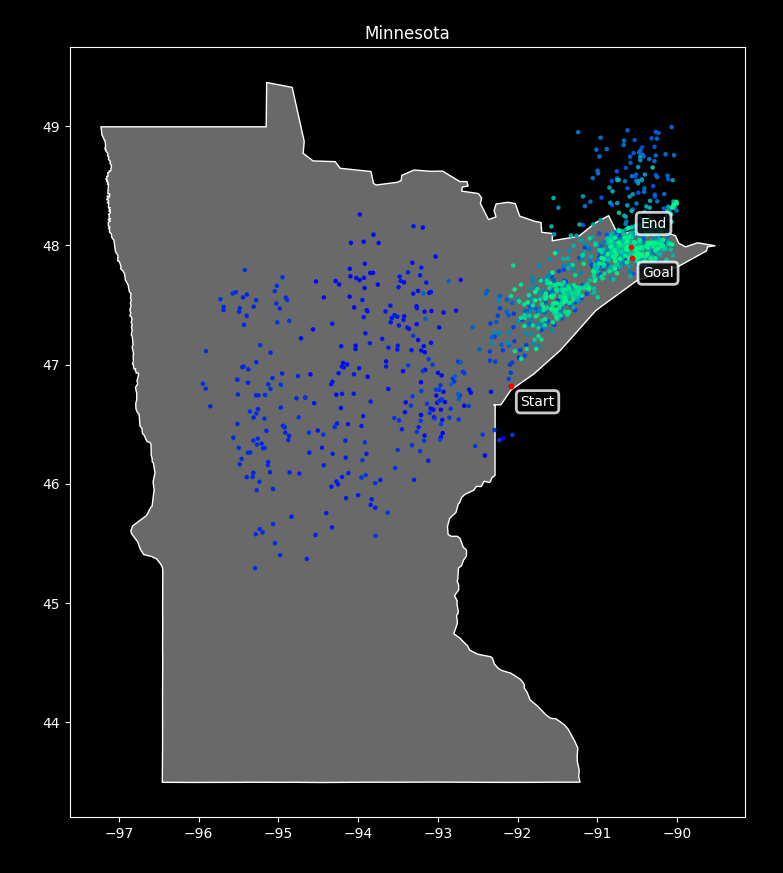

# Simulated Annealing
An implementation of the simulated annealing algorithm used to approximate the global optimum; in this case used to estimate the highest point in Minnesota (Eagle Mountain).

### Successes
These images show several of the successful runs of this simulated annealing algorithm. For each image, the following parameters were used:

| Parameter |  Value |
| :--- |-------:|
| Scheduler | Linear |
| Initial Temperature |     40 |
| Decay Rate |  0.005 |
| Limit | 100 |
| Successor Variance |   0.25 |

### Failure
This image is an example of the algorithm finding a local optimum rather than the global optimum. The program was run using the same parameters as the success images above.

### Outcome
Overall, the algorithm seems successful and the parameters I found to run it with find a point very near Eagle Mountain on nearly every iteration.
