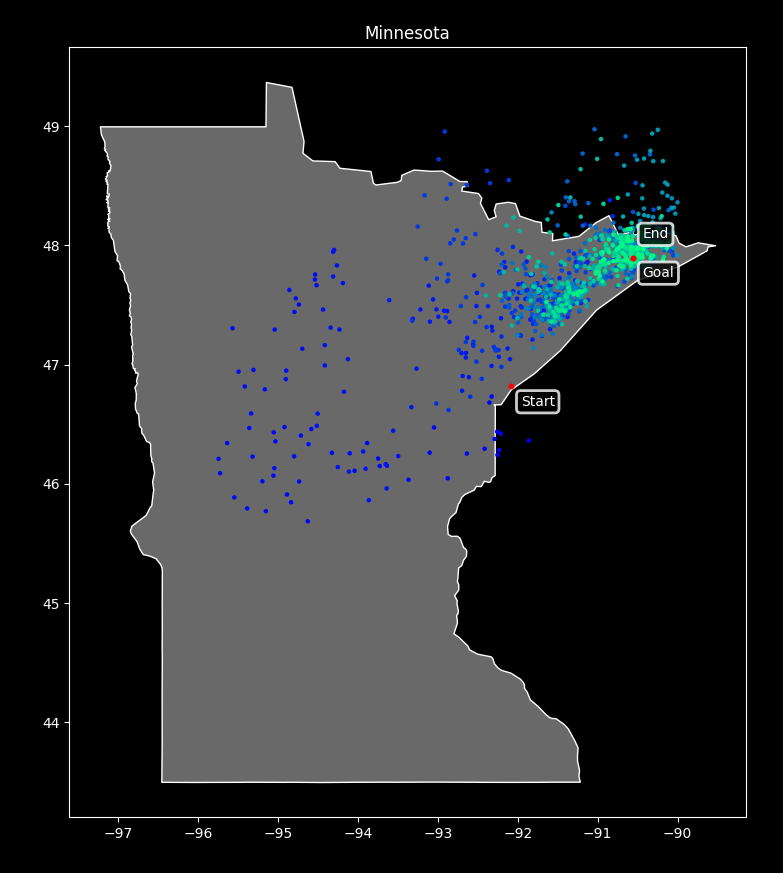
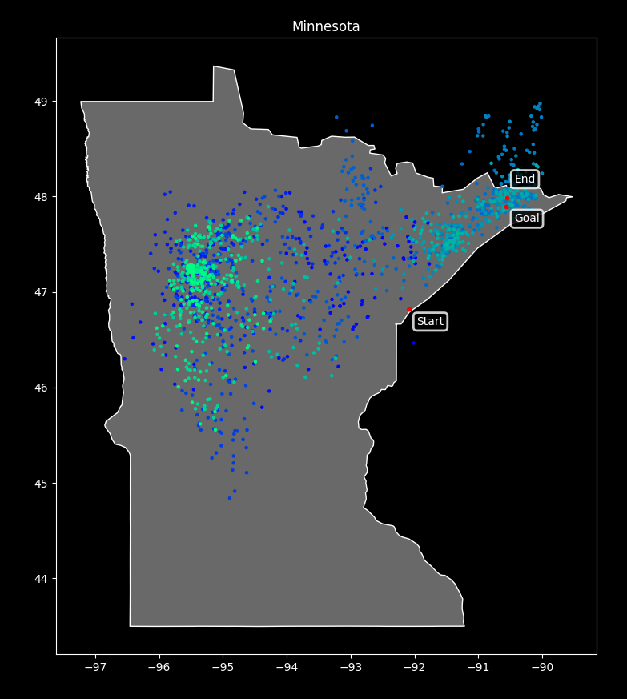

# Simulated Annealing
An implementation of the simulated annealing algorithm used to approximate the global optimum; in this case used to estimate the highest point in Minnesota (Eagle Mountain).

## Success
These images show several of the successful runs of this simulated annealing algorithm. In each image, the start and end points of the algorithm are labeled, as well as the goal. The points in between vary in color in accordance to their position in the iteration; from white (early values) to dark green (values closer to the end).
Most of the paths will either follow a track where early on, the points will scatter around the state and slowly converge on Eagle Mountain as they become darker green; or move more or less directly toward the goal. However, in some cases the points converge on a different location as the algorithm runs its course but the end is still shown near the goal. In these instances, elitism is being applied; where the best solution found so far is held and compared with each subsequent point and, in these cases, replaces the final point.
For each image, the following parameters were used:

| Parameter |  Value |
| :--- |-------:|
| Scheduler | Linear |
| Initial Temperature |     40 |
| Decay Rate |  0.005 |
| Limit | 100 |
| Successor Variance |   0.25 |

## Failure
This image is an example of the algorithm finding a local optimum rather than the global optimum. In this case, the algorithm happened to place all of its points far west of the goal, so no areas of higher elevation in northwest minnesota were found. Because it never even looked near the solution, elitism did not prevent this failure. A nonzero failure rate with results such as this is part of the trade-off between performance and accuracy I arrived at when setting the parameters.
When creating this image, the program was run using the same parameters as the other images.

## Outcome
Overall, the algorithm seems successful and the parameters I used find a point very near Eagle Mountain on most iterations.
The path taken by the algorithm can vary greatly each time it runs, as it uses a random normal distribution weighted in the direction of higher elevation to choose each successor. This means that sometimes the path to the solution will be more or less direct, with each point progressing from Duluth up the north shore in the general direction of Eagle Mountain. On the other hand, some iterations will jump all around Minnesota before settling on Eagle Mountain or an incorrect local optimum. For the highest accuracy, the search would look all over the state to rule out any local optimums every time, but that would come at the cost of longer runtimes and a potentially lower success rate.
Sometimes, the distribution of points across the map will create an approximation of a topographical map of minnesota, with more points concentrated at areas of higher elevation.
